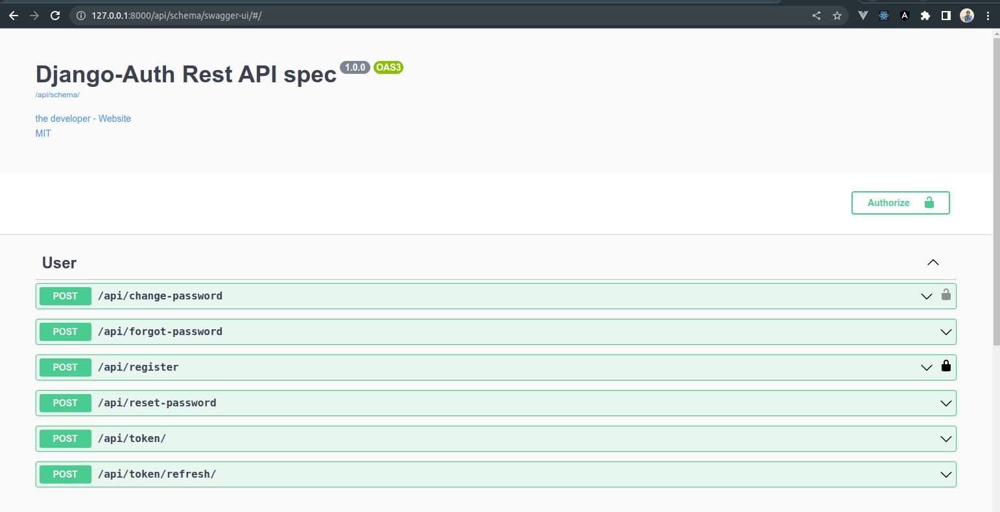

# DjangoRestAuth

This is a Python-Django auth system with most of the features you would need when starting a web api project.

It will save you money and months of building the same features that are common in any web api project. It is built using Python Django Framework and Restful Api's. It is an API only project.



# Features

The features are mostly centred around authentication and authorisation, and they are very easily extensible.
This project also comes with OpenAPI-based [drf-spectacular](https://drf-spectacular.readthedocs.io/en/latest/readme.html) REST API documentation, providing clear and detailed information on the project's endpoints, request and response formats, and other technical specifications.
The features currently present are:

-   Register

-   Authenticate

-   JWT Token Refresh

-   Show current user

-   Reset Password

-   Forgot Password Request

# Usage Development

### Prerequisites

Before setting up the project, make sure you have Python 3.8 or higher installed on your system. You can check your Python version by running the following command:

### Installation

1. Clone the repository to your local machine:
2. Navigate to the project directory:

```
cd Backend
```

3. Create a .env file in the project root directory and set the environment variables. Include the following:

```
SECRET_KEY="foo"
DEBUG=TRUE
ACCESS_TOKEN_LIFETIME_HOURS=24
REFRESH_TOKEN_LIFETIME_WEEKS=1
RESET_PASSWORD_TOKEN_MAX_AGE=3
EMAIL_HOST_USER="user@example.com"
EMAIL_HOST_PASSWORD="password"
```

4. Install the project dependencies by running the following command:

```
pip install -r requirements.txt
```

### Running the project

1. Navigate to the project directory:

```
cd Backend
```

2. Run the following command to start the development server:

```
python manage.py runserver
```

3. Open your web browser and navigate to http://127.0.0.1:8000/ to access the application.

### Additional commands

-   Run python3 manage.py makemigrations to create database migrations
-   Run python3 manage.py migrate to apply the migrations
-   Run python3 manage.py createsuperuser to create a superuser account
-   Run python3 manage.py test to run the test cases. Coming soon with some tests

# Folder Structure:

```
root
├── Backend
│   ├── backend
│   │    ├── settings.py
│   │    ├── urls.py
│   │    ├── wsgi.py
│   │    ├── asgi.py
│   │    └── __init__.py
│   │
│   │
│   ├── base
│   │    ├── Migrations (folder)
│   │    ├── __init__.py
│   │    ├── admin.py
│   │    ├── apps.py
│   │    ├── emails.py
│   │    ├── forms.py
│   │    ├── schemas.py
│   │    ├── serializers.py
│   │    ├── tests.py
│   │    ├── urls.py
│   │    └── views.py
│   │
│   └── templates
│   │    └── emails (folder)
│   │       └── send_forgotpassword_token.html
│   │
│   ├── .env
│   └── manage.py
│
│
├── Frontend (Testing with realtime client application)
└──  README.MD
```

# Why

I have created several Django Restful apps recently. Setting the users and JWT Auth up is kinda the bottleneck for me to make the ideas simply come true within a very short time.

So I made this starter Auth for myself to create apps more easily, along with some good practices that I have learned from making those apps. It's strongly opinionated, but feel free to tweak it or even maintain your own forks.
